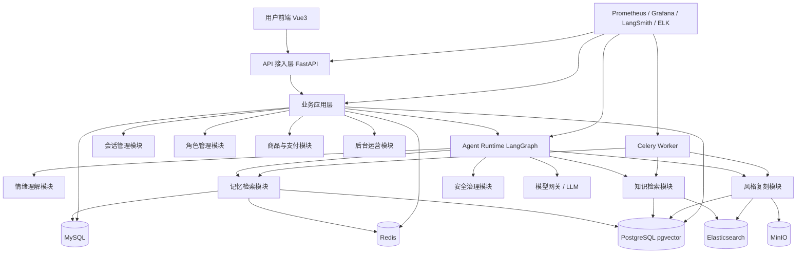
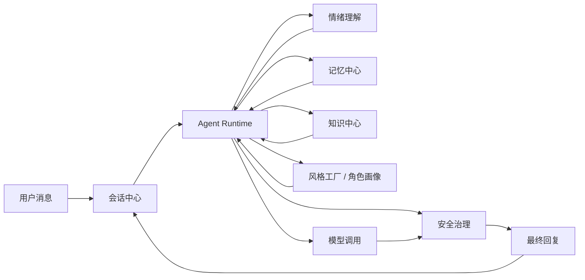
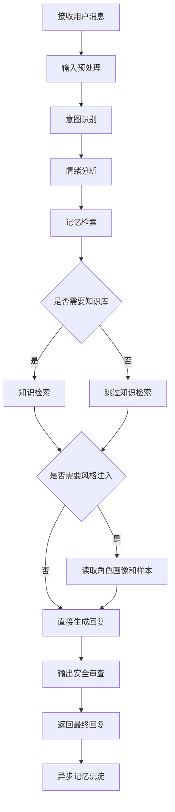
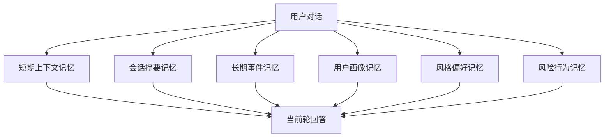
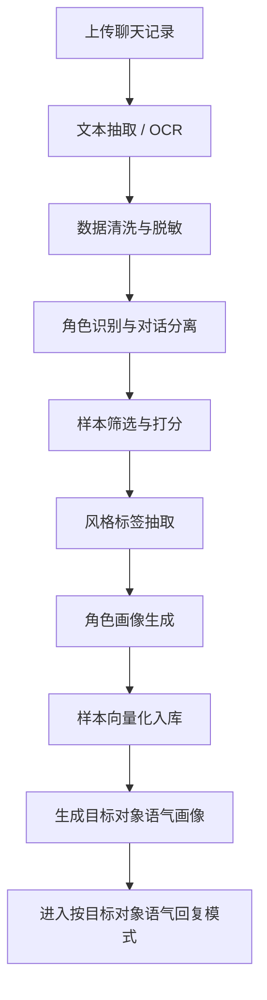
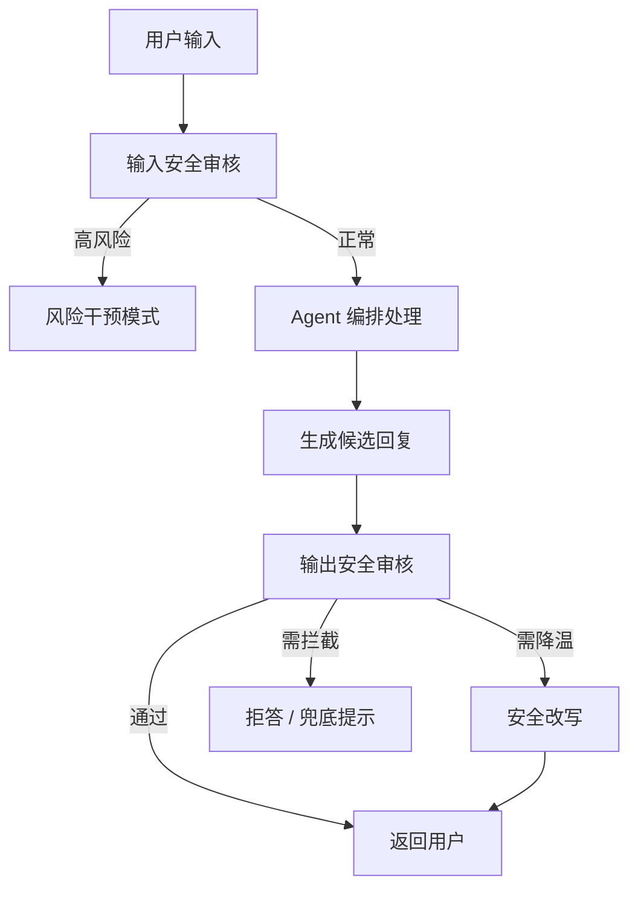

# AI 恋爱智能体项目架构设计文档（企业级 Python 版）

## 文档信息

| 项目 | 内容 |
| --- | --- |
| 文档名称 | AI 恋爱智能体项目架构设计文档（企业级 Python 版） |
| 项目名称 | `AI Love Agent` |
| 适用阶段 | 立项评审 / 技术选型 / 架构设计 / MVP 落地 |
| 技术主线 | `Python AI Native` |

---

## 目录

- [1. 项目概述](#1-项目概述)
- [2. 产品业务设计](#2-产品业务设计)
- [3. 企业级 Python 技术选型](#3-企业级-python-技术选型)
- [4. 总体系统架构设计](#4-总体系统架构设计)
- [5. 模块关系与职责说明](#5-模块关系与职责说明)
- [6. Agent 体系与编排设计](#6-agent-体系与编排设计)
- [7. Skill 体系设计](#7-skill-体系设计)
- [8. MCP 接入规划](#8-mcp-接入规划)
- [9. RAG 与记忆系统设计](#9-rag-与记忆系统设计)
- [10. Prompt 工程体系设计](#10-prompt-工程体系设计)
- [11. 私人定制语气复刻引擎设计](#11-私人定制语气复刻引擎设计)
- [12. 安全治理与企业合规设计](#12-安全治理与企业合规设计)
- [13. 数据存储与核心数据设计](#13-数据存储与核心数据设计)
- [14. 可观测性与评估体系设计](#14-可观测性与评估体系设计)
- [15. 部署架构与演进路线](#15-部署架构与演进路线)
- [16. 版本规划建议](#16-版本规划建议)
- [17. 项目所需配置清单](#17-项目所需配置清单)
- [18. 最终技术选型结论](#18-最终技术选型结论)

---

## 1. 项目概述

### 1.1 项目定位

`AI Love Agent` 是一款面向情感陪伴、恋爱沟通训练、个性化语气复刻、长期关系记忆管理的企业级 AI 智能体平台。

本项目不是简单的聊天机器人，也不是纯角色扮演应用，而是一个具备以下能力的可落地 AI Agent 系统：

- 真实感较强的长期陪伴能力
- 场景化恋爱建议和沟通指导能力
- 基于聊天记录的专属语气复刻能力
- 长期记忆驱动的关系连续性能力
- 可观测、可审计、可治理的企业级运行能力

### 1.2 项目目标

- 为用户提供持续稳定的情感陪伴体验。
- 为用户提供可执行、场景化的恋爱沟通建议。
- 通过“私人定制语气复刻”构建高价值付费能力。
- 通过长期记忆让智能体具备持续关系感。
- 通过安全治理、审计和评估体系实现企业可落地。

### 1.3 目标用户

- 单身用户：需要陪伴、聊天训练、情感支持。
- 恋爱中用户：需要沟通建议、情绪支持、冲突处理建议。
- 情绪困扰用户：需要温和、非医疗性质的情感陪伴。
- 高付费用户：希望上传 QQ、微信等聊天记录，按目标对象语气获得高拟真互动体验。

### 1.4 核心商业定位

- 免费功能承担拉新和留存。
- 一次性付费能力承担核心收入。
- 私人定制语气复刻承担高毛利商业化能力。
- 聊天记录导入、语气风格调参、追加定制次数承担增购能力。

---

## 2. 产品业务设计

### 2.1 核心业务能力

本项目围绕以下五大核心业务能力建设：

1. 标准情感陪伴能力
2. 恋爱沟通指导能力
3. 私人定制语气复刻能力
4. 长期记忆与关系连续性能力
5. 安全治理与风险控制能力

### 2.2 业务模块拆分

| 模块 | 核心功能 | 业务价值 |
| --- | --- | --- |
| 基础陪伴模块 | 标准角色聊天、情绪安抚、闲聊互动、基础建议 | 拉新、留存、建立信任 |
| 恋爱指导模块 | 开场建议、约会建议、冲突沟通、分手修复、表达优化 | 提升产品实用价值 |
| 私人定制语气模块 | 上传 QQ / 微信聊天记录、风格分析、角色画像生成、按目标对象语气回复 | 核心付费能力、核心壁垒 |
| 长期记忆模块 | 用户画像、重要事件、关系状态、偏好和敏感点管理 | 提升真实感、留存和复购 |
| 安全治理模块 | 输入输出审核、依赖风险识别、隐私管理、审计 | 满足企业落地和平台治理要求 |

### 2.3 典型用户场景

| 场景 | 用户诉求 | 系统响应模式 |
| --- | --- | --- |
| 日常陪伴 | 想找人聊天、被理解、被回应 | 陪伴模式 |
| 情绪低落 | 需要安抚、倾听、减压 | 情绪安抚模式 |
| 追求对象沟通 | 不知道怎么回消息、怎么推进关系 | 恋爱建议模式 |
| 模拟特定对象 | 想体验某人风格、训练交流方式 | 风格复刻模式 |
| 长期关系互动 | 希望 AI 记得自己、形成稳定关系感 | 长期记忆模式 |

### 2.4 免费与付费设计建议

| 版本 | 功能范围 |
| --- | --- |
| 免费版 | 基础角色、每日限量对话、基础陪伴、体验型建议 |
| 付费版 | 支持上传 QQ / 微信聊天记录，提取目标对象语气，并按该语气回答用户问题 |

---

## 3. 企业级 Python 技术选型

### 3.1 设计原则

- 采用 `Python AI Native` 技术路线。
- 优先使用企业常见、生态成熟、持续演进的主流框架。
- 单体优先、模块化设计，避免早期微服务复杂化。
- 统一建设 Agent 编排、Prompt 治理、记忆系统、安全治理和可观测体系。

### 3.2 技术选型总表

| 技术领域 | 推荐技术 | 选型说明 |
| --- | --- | --- |
| 语言版本 | `Python 3.11+` | 性能、类型系统、生态成熟度更适合企业 AI 应用 |
| API 框架 | `FastAPI` | Python 企业 API 与 AI 服务主流框架，高性能、自动文档、类型友好 |
| 数据校验 | `Pydantic v2` | 结构化输入输出、工具参数、Agent 结果校验标准方案 |
| ORM | `SQLAlchemy 2.0` | 企业级关系数据建模和持久化能力 |
| 数据迁移 | `Alembic` | 数据库版本管理 |
| Agent 编排 | `LangGraph` | 复杂工作流、状态流转、条件路由、持久化执行 |
| LLM 能力封装 | `LangChain` | 模型接入、工具调用、Prompt 组织、统一抽象 |
| RAG 增强 | `LlamaIndex` 可选 | 在复杂知识接入、索引、检索增强时按需引入 |
| 关系数据库 | `MySQL` | 当前业务主库，承载用户、订单、角色、Prompt、画像、审计等核心业务数据 |
| 缓存和会话 | `Redis` | 会话状态、短期上下文、限流、热点缓存 |
| 向量数据库 | `PostgreSQL + pgvector` | 当前阶段采用 PG 向量能力，降低组件数量，便于统一管理记忆、样本与知识向量 |
| 混合检索 | `Elasticsearch`引入关键词检索与混合检索，增强知识库、聊天记录和风格样本召回能力 |
| 对象存储 | `MinIO` | 上传聊天记录、原始文件、分析报告存储 |
| 异步任务 | `Celery` | 风格分析、Embedding 构建、记忆整理等异步任务处理 |
| 任务调度 | `Celery Beat` | 定时清理、画像刷新、索引维护 |
| 模型网关 | `LiteLLM` 可选 | 多模型路由、成本治理、供应商解耦 |
| 监控 | `Prometheus + Grafana` | 企业标准监控体系 |
| 日志 | `ELK` 或 `Loki` | 集中式日志检索与分析 |
| Trace / 调试 | `LangSmith + OpenTelemetry` | Agent 全链路可观测与评估 |
| 部署 | `Docker + Docker Compose` | MVP 到中早期生产环境足够稳定 |
| 后续编排 | `Kubernetes` | 用户规模增长后的标准演进路线 |

### 3.3 为什么采用 Python AI Native 架构

| 设计方向 | 说明 |
| --- | --- |
| 统一技术栈 | 降低 Java 与 Python 双栈协作成本，减少领域拆分和接口复杂度 |
| 更适合 AI 业务 | Agent、Prompt、RAG、Memory、安全治理都更贴近 Python 生态 |
| 迭代效率高 | 模型策略、工作流、Prompt 配置更适合快速实验和灰度 |
| 工程可控 | 用模块化单体替代早期微服务，降低运维复杂度 |


## 4. 总体系统架构设计

### 4.1 总体架构说明

本项目采用“企业级 Python 单体优先、模块化 AI 子域拆分”的架构形态。逻辑上分层，部署上前期可以单体，后期可按边界逐步拆分。

### 4.2 总体系统架构图



### 4.3 分层架构说明

| 层级 | 核心模块 | 主要职责 |
| --- | --- | --- |
| 接入层 | 前端、API 网关、鉴权、限流 | 接收请求、身份校验、协议适配、流式输出 |
| 业务应用层 | 会话、角色、商品支付、后台、配置管理 | 承载产品业务逻辑 |
| Agent 编排层 | LangGraph Runtime | 决策、分流、工作流执行、工具调用 |
| AI 能力层 | 情绪、记忆、知识、风格、安全模块 | 实现智能体核心能力 |
| 数据存储层 | MySQL、PostgreSQL(pgvector)、Redis、MinIO、Elasticsearch| 业务数据、缓存、向量索引、对象存储、混合检索 |
| 异步任务层 | Celery、定时调度 | 风格分析、记忆整理、批处理任务 |
| 运维观测层 | Prometheus、Grafana、LangSmith、日志系统 | 监控、日志、评估、排障 |

---

## 5. 模块关系与职责说明

### 5.1 模块职责总表

| 模块 | 输入 | 输出 | 依赖模块 |
| --- | --- | --- | --- |
| 会话中心 | 用户消息、会话 ID | 会话状态、消息记录、上下文窗口 | MySQL、Redis、Agent Runtime |
| 角色中心 | 角色配置、语气定制请求 | 标准角色、语气画像、画像绑定结果 | MySQL、风格复刻模块 |
| 记忆中心 | 会话摘要、用户行为、历史事件 | 用户画像、长期记忆、偏好标签 | MySQL、PostgreSQL(pgvector)、Celery |
| 知识中心 | 业务知识文档、策略库 | 知识索引、检索结果 | PostgreSQL(pgvector)、MinIO、Elasticsearch
| 风格工厂 | 聊天记录、上传文件 | 风格标签、角色画像、样本索引 | MinIO、PostgreSQL(pgvector)、Celery、Elasticsearch |
| Agent Runtime | 用户消息、上下文、模式配置 | 最终回复、工具调用结果、节点状态 | 记忆、知识、风格、安全、模型 |
| 安全治理中心 | 用户输入、候选回复、行为特征 | 风险等级、拦截结果、降温结果 | 规则库、模型审核器、日志系统 |
| 运营后台 | 用户数据、会话数据、风险事件 | 运营配置、Prompt 发布、审计记录 | 全部核心模块 |

### 5.2 模块关系说明

- 会话中心负责对外承接用户消息，是所有业务流程的入口模块。
- Agent Runtime 是系统大脑，负责根据当前上下文决定走哪一条处理链路。
- 记忆中心负责沉淀长期关系数据，为连续陪伴提供基础。
- 知识中心负责为恋爱建议、风险干预等场景提供可检索知识支撑。
- 风格工厂负责将上传聊天记录转换为可执行的角色画像和风格样本。
- 安全治理中心位于输入侧和输出侧双向拦截，是平台合规核心能力。
- 运营后台提供 Prompt 管理、角色治理、风险审计、知识维护等平台化能力。

### 5.3 核心模块调用关系图



---

## 6. Agent 体系与编排设计

### 6.1 设计原则

本项目不采用完全放飞式的开放 Agent，而采用“可控编排型 Agent”架构。原因如下：

- 恋爱陪伴场景风险高，必须控制路径和边界。
- 情绪支持和风格复刻涉及较强安全约束。
- 企业级系统必须支持调试、回放、审计和灰度。

### 6.2 Agent 分层设计

| 层级 | 职责 |
| --- | --- |
| 会话接入层 | 接收消息、恢复上下文、处理流式响应 |
| 主编排层 | 意图识别、模式切换、工作流调度 |
| 情绪理解层 | 情绪识别、风险识别、响应策略建议 |
| 记忆与知识层 | 长期记忆检索、知识检索、样本召回 |
| 风格注入层 | 角色画像读取、风格约束构建、few-shot 召回 |
| 安全治理层 | 输入输出审核、降温、拦截、风险升级 |

### 6.3 Agent 角色单元设计

| Agent / 能力单元 | 主要职责 |
| --- | --- |
| 主编排 Agent | 判断进入陪伴、建议、复刻、安抚、风险干预等模式 |
| 情绪识别 Agent | 输出结构化情绪标签和强度评分 |
| 记忆检索 Agent | 召回用户画像、长期事件、偏好和敏感点 |
| 知识建议 Agent | 召回恋爱知识并输出可执行建议 |
| 风格复刻 Agent | 根据画像和样本生成风格一致的回复策略 |
| 安全审查 Agent | 对输入输出做风险扫描和修正 |
| 记忆整理 Agent | 对会话摘要、打标签并沉淀长期记忆 |

### 6.4 LangGraph 工作流设计



### 6.5 模式路由说明

| 模式 | 进入条件 | 典型处理策略 |
| --- | --- | --- |
| 陪伴模式 | 日常聊天、轻情绪交流 | 优先自然互动和轻量记忆注入 |
| 情绪安抚模式 | 明显失落、焦虑、孤独等表达 | 先共情再回应，降低建议密度 |
| 恋爱建议模式 | 请求如何回复、如何推进关系等 | 检索知识库并输出可执行建议 |
| 风格复刻模式 | 已选择定制角色或请求模拟某人风格 | 注入角色画像和样本表达 |
| 风险干预模式 | 自伤、极端依赖、未成年人敏感内容 | 安全优先、限制风格沉浸、输出兜底话术 |

---

## 7. Skill 体系设计

### 7.1 Skill 设计目标

为了提升能力复用性和治理能力，建议将高频场景能力设计为 Skill，而不是零散 Prompt。

### 7.2 Skill 组成结构

每个 Skill 建议包含以下内容：

- 输入结构定义
- 输出结构定义
- Prompt 模板
- 工具调用规则
- 安全约束规则
- 评估指标

### 7.3 推荐 Skill 列表

| Skill 名称 | 适用场景 |
| --- | --- |
| 情绪安抚 Skill | 用户低落、委屈、孤独、焦虑时 |
| 暧昧推进 Skill | 用户咨询如何拉近关系时 |
| 冲突沟通 Skill | 用户处理争吵、冷战、误会时 |
| 分手修复 Skill | 用户需要温和表达和边界控制时 |
| 风格复刻 Skill | 用户希望模拟某人说话风格时 |
| 风险降温 Skill | 用户出现过度依赖、沉浸倾向时 |
| 晚安陪伴 Skill | 用户固定场景陪伴互动 |
| 纪念日提醒 Skill | 重要时间点关怀和运营增强 |

---

## 8. MCP 接入规划

### 8.1 MCP 定位

MCP 是模型连接外部工具和上下文系统的标准协议。本项目对 MCP 的使用定位是“企业能力扩展标准接口”，而不是 MVP 必选项。

### 8.2 MCP 在本项目中的适用场景

| 场景 | 说明 |
| --- | --- |
| 知识工具接入 | 将知识检索、文档解析、配置查询等能力标准化接入 |
| 运营后台工具接入 | 审计查询、角色配置、会话查询、风险事件处理 |
| 外部系统接入 | CRM、工单、支付、通知、文件系统等未来扩展场景 |
| Prompt / 配置平台接入 | 将模型上下文和配置服务做成标准能力接口 |

### 8.3 接入策略建议

- MVP 阶段不强制全部 MCP 化。
- 对稳定、可复用、跨系统共享的能力优先进行 MCP 封装。
- 将 MCP 作为中后期平台化能力建设方向。

---

## 9. RAG 与记忆系统设计

### 9.1 RAG 定位

本项目中的 RAG 不是单一知识问答能力，而是多源上下文增强能力。

### 9.2 RAG 分类设计

| RAG 类型 | 数据来源 | 用途 |
| --- | --- | --- |
| 恋爱知识库 RAG | 恋爱沟通、约会、冲突处理等知识文档 | 输出更专业、可执行的建议 |
| 用户长期记忆 RAG | 用户画像、长期事件、偏好、敏感点 | 构建关系连续性 |
| 私人语气样本 RAG | 上传聊天记录中筛选出的高质量样本 | 提升风格复刻一致性 |
| 风险干预知识库 RAG | 危机安抚、风险兜底、安全策略文档 | 风险场景安全输出 |

### 9.3 检索策略建议

- 元数据过滤
- 向量检索
- 关键词检索
- 混合检索
- 重排排序

### 9.4 记忆系统分层设计



### 9.5 记忆分层说明

| 记忆类型 | 存储介质 | 说明 |
| --- | --- | --- |
| 短期上下文 | Redis | 当前会话窗口，响应速度优先 |
| 会话摘要 | MySQL / PostgreSQL(pgvector) | 对单次或多次对话进行摘要沉淀 |
| 长期事件记忆 | MySQL / PostgreSQL(pgvector) | 重要事件、关系变化、关键节点 |
| 用户画像记忆 | MySQL | 用户稳定属性、偏好、禁忌、目标 |
| 风格偏好记忆 | MySQL / PostgreSQL(pgvector) | 用户喜欢的角色风格和表达方式 |
| 风险行为记忆 | MySQL | 风险事件、依赖倾向、安全审计记录 |

---

## 10. Prompt 工程体系设计

### 10.1 设计原则

Prompt 必须作为企业级可治理资产，而不是写死在代码中的单段文本。

设计原则如下：

- 模块化
- 可版本化
- 可灰度
- 可 A/B 测试
- 可回滚
- 可审计

### 10.2 Prompt 分层结构

| Prompt 层 | 说明 |
| --- | --- |
| 系统身份 Prompt | 定义智能体身份和产品边界 |
| 安全策略 Prompt | 约束不允许的输出、风险处理规则 |
| 模式控制 Prompt | 定义陪伴、建议、安抚、复刻等场景行为 |
| 风格注入 Prompt | 根据角色画像和样本构造风格约束 |
| 记忆注入 Prompt | 将长期记忆和当前上下文注入回答 |
| 场景任务 Prompt | 当前轮具体任务描述和输出要求 |

### 10.3 Prompt 管理能力

| 能力 | 说明 |
| --- | --- |
| 版本管理 | 支持 Prompt 迭代和历史回滚 |
| 启停控制 | 支持按场景启用和停用 |
| 灰度发布 | 支持按用户组灰度 |
| 实验对比 | 支持 Prompt A/B 测试 |
| 效果评估 | 结合用户反馈和模型指标评估效果 |

---

## 11. 私人定制语气复刻引擎设计

### 11.1 总体目标

构建可复用、可扩展、可控边界的语气复刻引擎，使 AI 在保持合规和安全前提下具备高拟真的个性化表达能力。

### 11.2 处理流程



### 11.3 角色画像字段设计

| 字段 | 说明 |
| --- | --- |
| 角色名称 | 目标对象名称或语气画像名称 |
| 角色来源 | 上传记录来源说明 |
| 关系标签 | 暗恋对象、伴侣、理想型等 |
| 人格标签 | 温柔、理性、慢热、幽默等 |
| 语气标签 | 短句、克制、爱反问、喜欢昵称等 |
| 高频表达 | 常见口头禅、昵称、结束语 |
| 情绪模式 | 热情型、稳定型、敏感型等 |
| 回复节奏 | 主动性、延展性、回应密度 |
| 禁忌表达 | 不使用词语、不触达话题 |
| few-shot 样本 | 高质量风格样本片段 |
| 可用性评分 | 画像质量评分 |

### 11.4 风格生成策略

风格生成应结合以下输入共同决策：

- 角色画像摘要
- 检索到的样本表达
- 当前用户消息
- 最近对话上下文
- 长期关系记忆
- 当前模式约束
- 安全治理约束

### 11.5 核心设计原则

- 不直接把全部聊天记录塞入 Prompt。
- 只保留高质量、可复用、可治理的样本片段。
- 风格复刻必须服从安全边界，不能为了像而越界。

---

## 12. 安全治理与企业合规设计

### 12.1 风险特点

AI 恋爱智能体相比普通聊天产品，具有更高的内容风险和伦理风险：

- 更容易形成情绪依赖
- 更容易进入沉浸式亲密关系场景
- 更容易接触隐私对话数据
- 更容易服务情绪脆弱用户

### 12.2 安全治理目标

- 确保输出不违法、不越界、不伤害用户
- 确保系统不强化危险依赖
- 确保用户隐私可控、数据可删除、过程可审计

### 12.3 核心治理能力

| 能力 | 说明 |
| --- | --- |
| 输入审核 | 检测敏感内容、风险话题、未成年人相关表达 |
| 输出审核 | 审查候选回复是否违规、失当、强化依赖 |
| 高风险情绪识别 | 识别自伤、自杀、极端失控等表达 |
| 依赖强度监测 | 识别强依恋、现实替代倾向 |
| 风险降温策略 | 调整语气、弱化绑定表达、鼓励现实支持 |
| 人工审核接口 | 为高风险事件预留人工复核路径 |
| 审计日志 | 保留规则命中、模型输出、处理结果 |

### 12.4 依赖治理机制

建议建立依赖风险评分机制，综合以下因素：

- 高频连续使用
- 深夜高情绪互动频率
- 强依恋表达比例
- 对现实关系替代倾向
- 过度拟人化沉浸程度

### 12.5 安全治理流程图



---

## 13. 数据存储与核心数据设计

### 13.1 存储分层设计

| 存储类型 | 技术选型 | 存储内容 |
| --- | --- | --- |
| 关系型数据库 | MySQL | 用户、订单、商品、角色、会话元数据、画像、Prompt、审计 |
| 缓存 / 状态 | Redis | 会话状态、上下文、限流、热点缓存 |
| 向量数据库 | PostgreSQL(pgvector) | 长期记忆、知识片段、风格样本、风险知识 |
| 混合检索引擎 | Elasticsearch | 关键词检索、过滤检索、混合检索增强 |
| 对象存储 | MinIO | 上传聊天记录、原始文件、分析报告 |

### 13.2 核心数据对象建议

| 数据对象 | 说明 |
| --- | --- |
| 用户 | 账号信息、购买记录、基础画像 |
| 会话 | 会话标识、模式、当前状态、上下文摘要 |
| 消息元数据 | 消息类型、来源、风险标签、命中策略 |
| 角色 | 标准角色和定制角色配置 |
| 角色画像 | 风格标签、人格标签、样本摘要、禁忌规则 |
| 长期记忆 | 事件记录、偏好、关系变化、重要节点 |
| 知识条目 | 恋爱知识、风险话术、安全策略 |
| 风险事件 | 风险类型、命中规则、处理结果 |
| Prompt 配置 | Prompt 版本、启停状态、适用场景 |

### 13.3 当前仓库已落地的核心表

当前仓库为了降低本地联调成本，已经按“业务表 + 向量表”两层结构落了最小可用数据模型，并在服务启动时自动执行缺表创建。

关系型业务表：

- `users`：用户主表，保存账号、昵称、头像、基础画像
- `agent_profiles`：智能体配置表，保存模式、人设、Prompt 版本
- `conversation_sessions`：会话表，保存标题、模式、摘要、风险级别
- `conversation_messages`：消息表，保存逐条对话、trace 与安全标签
- `safety_events`：风控事件表，保存命中类型、处理动作和审计快照

向量表：

- `memory_embeddings`：长期记忆向量
- `knowledge_embeddings`：知识库向量
- `style_sample_embeddings`：风格样本向量

自动建表策略：

- MySQL 使用 `SQLAlchemy create_all`，缺表时自动补齐
- PostgreSQL 在建表前先执行 `CREATE EXTENSION IF NOT EXISTS vector`
- 初始化失败只记日志，不阻塞 API 启动，方便本地分模块联调

---

## 14. 可观测性与评估体系设计

### 14.1 可观测性目标

企业级 AI 系统不能只关注接口是否成功，还必须关注：

- 模型调用成本
- 请求时延
- Agent 节点耗时
- Prompt 命中情况
- 检索召回效果
- 风险命中情况
- 用户满意度趋势

### 14.2 观测工具建议

| 能力 | 工具 |
| --- | --- |
| 系统监控 | `Prometheus + Grafana` |
| 日志分析 | `ELK` 或 `Loki` |
| Agent Trace | `LangSmith` |
| 全链路埋点 | `OpenTelemetry` |

### 14.3 评估指标建议

| 指标维度 | 说明 |
| --- | --- |
| 回复自然度 | 是否自然、流畅、符合人类表达习惯 |
| 风格一致性 | 是否稳定符合目标角色画像 |
| 建议实用性 | 是否提供可执行、合理建议 |
| 情绪安抚有效性 | 是否有效降低负向情绪 |
| 记忆命中率 | 是否正确召回有用记忆 |
| 检索准确率 | 是否召回正确知识和样本 |
| 风险拦截有效率 | 是否成功拦截危险输出 |
| 付费转化率 | 是否支撑核心商业指标 |

---

## 15. 部署架构与演进路线

### 15.1 第一阶段：企业级单体

部署组件建议如下：

- FastAPI 主服务
- Celery Worker
- MySQL
- Redis
- PostgreSQL(pgvector)
- MinIO
- Nginx
- Prometheus / Grafana

适用场景：

- MVP
- 小规模商业验证
- 快速迭代阶段

### 15.2 第二阶段：模块化拆分

在业务增长后，建议逐步拆分以下独立服务：

- 会话服务
- Agent Runtime 服务
- 风格分析服务
- RAG 检索服务
- 安全治理服务
- 后台管理服务

### 15.3 第三阶段：平台化与高可用演进

建议演进为：

- Kubernetes 编排
- Elasticsearch 混合检索集群
- 模型网关统一路由
- 多副本高可用
- 灰度发布体系
- 风险审核平台化
- Prompt 平台化
- 多租户能力扩展

---

## 16. 版本规划建议

### 16.1 MVP 版本

- 标准角色陪伴
- 基础恋爱建议
- 基础长期记忆
- 私人语气复刻 1.0
- 输入输出安全审核
- 免费版与付费版基础能力

### 16.2 1.0 版本

- 多角色管理
- 风格调参
- 更完整的恋爱知识库
- Prompt 管理后台
- 风险依赖评分
- 基础评估与监控看板

### 16.3 2.0 版本

- 语音风格扩展
- 多模态互动
- 更复杂的角色关系系统
- MCP 工具接入
- 企业级运营自动化能力

---

## 17. 项目所需配置清单

### 17.1 配置设计原则

为了便于本地开发、测试部署和后续环境迁移，所有中间件地址、账号、密钥、对象存储、向量库、外部搜索和平台级配置应统一维护在配置文件中，不允许硬编码分散在业务代码里。

建议采用以下管理原则：

- 本地开发环境使用 `application-local.yml` 或 `.env`。
- 测试与生产环境使用独立配置文件或配置中心。
- 密钥类配置必须支持环境变量覆盖。
- 文档中保留配置项说明，不保留真实生产密钥。

### 17.2 当前项目所需配置范围

基于当前项目需求，以下配置建议纳入正式项目配置说明。

| 配置域 | 说明 | 是否核心必需 |
| --- | --- | --- |
| `spring.datasource` | 关系数据库连接配置 | 是 |
| `spring.datasource.hikari` | 数据库连接池配置 | 是 |
| `mybatis-plus` | MyBatis-Plus Mapper 配置 | 是，若项目采用 MyBatis-Plus |
| `spring.servlet.multipart` | 文件上传大小限制 | 是 |
| `minio` | 对象存储配置 | 是 |
| `embeddings.store` | 向量库或 Embedding 存储配置 | 是 |
| `tavily` | 外部搜索引擎配置 | 否，可选增强 |
| `grsai.nanobanana` | 第三方模型或服务配置 | 否，按实际业务启用 |
| `logging.level` | 日志级别控制 | 是 |
| `nft.turbo.*` | 外部基础设施地址汇总 | 仅在项目实际使用对应中间件时保留 |

### 17.3 推荐保留的配置项

以下配置项与当前 AI 恋爱智能体项目较为相关，建议保留到正式项目配置说明中：

| 配置项 | 用途 | 说明 |
| --- | --- | --- |
| `spring.datasource.url` | MySQL 连接地址 | 业务主库连接 |
| `spring.datasource.username` | MySQL 用户名 | 数据库账号 |
| `spring.datasource.password` | MySQL 密码 | 建议环境变量注入 |
| `spring.datasource.driver-class-name` | 驱动类 | MySQL 驱动 |
| `spring.datasource.hikari.*` | 连接池 | 数据库性能与稳定性 |
| `mybatis-plus.mapper-locations` | Mapper 路径 | 如果使用 MyBatis-Plus |
| `spring.servlet.multipart.*` | 上传限制 | 聊天记录、文件导入必需 |
| `minio.url` | MinIO 地址 | 上传文件和分析结果存储 |
| `minio.accessKey` | MinIO 账号 | 建议环境变量注入 |
| `minio.secretKey` | MinIO 密码 | 建议环境变量注入 |
| `minio.bucketName` | 存储桶 | 对应业务桶名 |
| `minio.endpoint` | MinIO Endpoint | SDK 访问地址 |
| `embeddings.store.host` | 向量库地址 | 长期记忆、知识库、风格样本检索 |
| `embeddings.store.port` | 向量库端口 | 向量库连接 |
| `embeddings.store.database` | 向量库存储库名 | 向量数据存储 |
| `embeddings.store.user` | 向量库账号 | 数据访问账号 |
| `embeddings.store.password` | 向量库密码 | 建议环境变量注入 |
| `tavily.api-key` | Tavily 搜索 Key | 外部搜索增强可选 |
| `tavily.mcp-url` | Tavily MCP 地址 | MCP 工具接入可选 |
| `logging.level.*` | 日志级别 | 调试与线上治理 |

### 17.4 建议移除或按需保留的配置项

以下配置并非当前项目的核心依赖，应根据实际是否使用来决定是否继续出现在正式文档中。

| 配置项 | 建议 | 原因 |
| --- | --- | --- |
| `nft.turbo.nacos.*` | 按需保留 | 仅在使用 Nacos 配置中心时需要 |
| `nft.turbo.redis.*` | 按需保留 | 如果 Redis 已通过主配置管理，则无需重复汇总 |
| `nft.turbo.elasticsearch.*` | 默认移除 | 当前架构并不依赖 ES 作为主检索引擎 |
| `nft.turbo.xxl-job.*` | 默认移除 | 当前推荐异步调度方案为 Celery |
| `nft.turbo.sentinel.*` | 默认移除 | 当前 MVP 阶段无需 Sentinel 治理体系 |
| `nft.turbo.rocketmq.*` | 默认移除 | 当前架构未将 RocketMQ 作为主依赖 |
| `nft.turbo.dubbo.*` | 默认移除 | 当前并非 Dubbo 微服务体系 |
| `nft.turbo.seata.*` | 默认移除 | 当前阶段不需要分布式事务体系 |

### 17.5 配置收敛建议

针对你提供的配置，建议正式项目文档中只保留以下几类核心配置：

- 数据库配置
- 文件上传配置
- MinIO 配置
- 向量库配置
- 外部搜索配置
- 日志级别配置

对以下配置建议从正式 Markdown 中删除或迁移为“可选扩展基础设施说明”：

- Nacos
- Sentinel
- RocketMQ
- Dubbo
- Seata
- XXL-JOB
- ElasticSearch

这样可以保证正式项目文档只体现“当前项目真正需要的配置”，避免把历史模板型基础设施混进 AI 项目方案里。

### 17.6 推荐配置模板

下面给出建议保留的正式配置模板，作为项目当前阶段需要维护的配置基线。

```yaml
spring:
  datasource:
    url: jdbc:mysql://localhost:3306/dodo?useUnicode=true&characterEncoding=utf8&useSSL=false&serverTimezone=GMT%2B8
    username: root
    password: ${DB_PASSWORD:replace_me}
    driver-class-name: com.mysql.cj.jdbc.Driver
    hikari:
      minimum-idle: 5
      maximum-pool-size: 20
      idle-timeout: 60000
      connection-timeout: 30000
      max-lifetime: 1800000

  servlet:
    multipart:
      enabled: true
      max-file-size: 50MB
      max-request-size: 50MB

mybatis-plus:
  mapper-locations: classpath:mapper/*.xml

minio:
  url: http://localhost:9000/
  accessKey: ${MINIO_ACCESS_KEY:minioadmin}
  secretKey: ${MINIO_SECRET_KEY:replace_me}
  bucketName: rag-test2
  endpoint: http://localhost:9000/

embeddings:
  store:
    host: localhost
    port: 5433
    database: rag
    user: cjs
    password: ${VECTOR_DB_PASSWORD:replace_me}

tavily:
  api-key: ${TAVILY_API_KEY:replace_me}
  mcp-url: https://mcp.tavily.com/mcp/

logging:
  level:
    org:
      springframework:
        ai: INFO
    io:
      modelcontextprotocol:
        client: ERROR
```

### 17.7 当前接入配置映射示例

基于当前项目讨论阶段，下面给出一份“配置项映射示例”，用于说明哪些配置需要进入项目文档和配置体系。这里保留配置项结构与示例值类型，用于本地联调说明；实际生产环境必须改为环境变量或 Secret 注入。

```yaml
spring:
  datasource:
    url: jdbc:mysql://localhost:3306/dodo?useUnicode=true&characterEncoding=utf8&useSSL=false&serverTimezone=GMT%2B8
    username: root
    password: ${DB_PASSWORD:replace_me}
    driver-class-name: com.mysql.cj.jdbc.Driver
    hikari:
      minimum-idle: 5
      maximum-pool-size: 20
      idle-timeout: 60000
      connection-timeout: 30000
      max-lifetime: 1800000

  servlet:
    multipart:
      enabled: true
      max-file-size: 50MB
      max-request-size: 50MB

mybatis-plus:
  mapper-locations: classpath:mapper/*.xml

minio:
  url: http://localhost:9000/
  accessKey: ${MINIO_ACCESS_KEY:minioadmin}
  secretKey: ${MINIO_SECRET_KEY:replace_me}
  bucketName: rag-test2
  endpoint: http://localhost:9000/

embeddings:
  store:
    host: localhost
    port: 5433
    database: rag
    user: cjs
    password: ${VECTOR_DB_PASSWORD:replace_me}

tavily:
  api-key: ${TAVILY_API_KEY:replace_me}
  mcp-url: https://mcp.tavily.com/mcp/

grsai:
  nanobanana:
    api-key: ${GRSAI_NANOBANANA_API_KEY:replace_me}

logging:
  level:
    org:
      springframework:
        ai: INFO
    io:
      modelcontextprotocol:
        client: ERROR
```

### 17.8 配置文件与密钥管理建议

为了满足“配置写到文档”和“密钥不进入仓库”两个要求，推荐采用以下落地方式：

| 文件 | 作用 | 是否提交 Git |
| --- | --- | --- |
| `application.yml` | 主配置模板，可保留非敏感默认值 | 是 |
| `.env.example` | 环境变量示例，仅包含键名和示例占位值 | 是 |
| `.env` | 本地开发真实密钥与口令 | 否 |
| `application-local.yml` | 本地私有配置 | 否 |
| `secrets/*.yml` | 私有环境配置文件 | 否 |

推荐原则如下：

- 文档中保留配置结构、说明和示例。
- 仓库中保留 `.env.example`，方便团队快速启动。
- 真实口令、数据库密码、对象存储密码、第三方 API Key 只放 `.env` 或 Secret 管理系统。
- `.gitignore` 必须忽略所有私有配置文件和密钥文件。

### 17.9 安全说明

你提供的配置片段中已经出现了真实口令和 API Key。正式文档中不建议直接保留真实值，建议全部替换为占位符或环境变量引用，原因如下：

- Markdown 文档容易被提交到 Git 仓库。
- 明文口令会形成极高的泄露风险。
- API Key 一旦泄露，可能导致费用损失和安全风险。

建议实际项目中统一采用以下方式处理：

- 文档只保留配置项名称和说明。
- 真实值通过 `.env`、CI/CD Secret、配置中心或环境变量注入。
- 已暴露的外部密钥建议立即轮换。

---

## 18. 最终技术选型结论

### 17.1 推荐主干技术栈

- `Python 3.11+`
- `FastAPI`
- `Pydantic v2`
- `SQLAlchemy 2.0`
- `Alembic`
- `LangGraph`
- `LangChain`
- `MySQL`
- `Redis`
- `PostgreSQL(pgvector)`
- `Elasticsearch`
- `Celery`
- `MinIO`
- `Prometheus + Grafana`
- `ELK / Loki`
- `LangSmith`
- `Docker + Docker Compose`

### 17.2 选型结论说明

该方案具备以下特点：

- 符合当前主流 Python AI 工程实践。
- 适合企业级 Agent 应用落地。
- 支持快速验证与后续扩展。
- 兼顾业务价值、技术可控性和商业化可落地性。

### 17.3 最终架构建议

对于当前阶段的 `AI Love Agent` 项目，建议采用以下落地路线：

- 前期采用企业级 Python 单体架构快速验证核心商业价值。
- 使用 LangGraph 作为 Agent 编排核心，统一承接陪伴、建议、风格复刻和安全治理流程。
- 使用 PostgreSQL 的 pgvector 能力构建长期记忆、知识库和风格样本三类向量检索能力。
- Elasticsearch 构建关键词检索、过滤检索和混合检索能力。
- 使用 Celery 承担风格分析、记忆整理和异步索引任务。
- 将安全治理、Prompt 管理、评估和运维观测纳入主系统设计，而不是后补模块。

---

## 附录：落地优先级建议

| 优先级 | 建设项 |
| --- | --- |
| P0 | 陪伴主链路、免费版与付费版、安全审核、基础记忆 |
| P1 | 私人语气复刻、恋爱建议知识库、Prompt 管理 |
| P2 | 风险依赖治理、评估体系、后台审计 |
| P3 | MCP 平台化、语音扩展、多模态、Kubernetes 演进 |

---

## 附录：当前仓库建议骨架

为了让架构设计能直接落到代码仓，当前仓库建议采用如下目录：

```text
ai-love/
  backend/
    app/
      api/
      schemas/
      domain/
      services/
      agents/
      prompts/
      memory/
      rag/
      safety/
      tasks/
      infra/
    tests/
    pyproject.toml
    .env.example
  frontend/
    src/
      api/
      layouts/
      router/
      styles/
      types/
      views/
    package.json
    .env.example
  docs/
  docker-compose.yml
```

该骨架对应以下落地原则：

- 前端采用 `Vue 3 + Vite + Ant Design Vue`，先承接控制台和联调工作台。
- 后端采用 `FastAPI` 单体骨架，先提供健康检查、会话入口和 Agent 主流程占位实现。
- `Memory / RAG / Safety / Prompt / Task` 统一独立分层，避免后续业务逻辑堆叠。
- 本地先通过 `Docker Compose` 拉起 `MySQL / Redis / PostgreSQL(pgvector) / MinIO`，满足最小联调需求。
