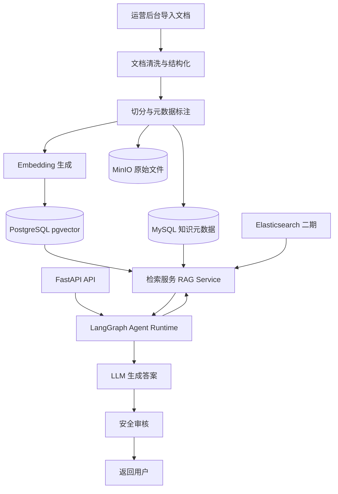
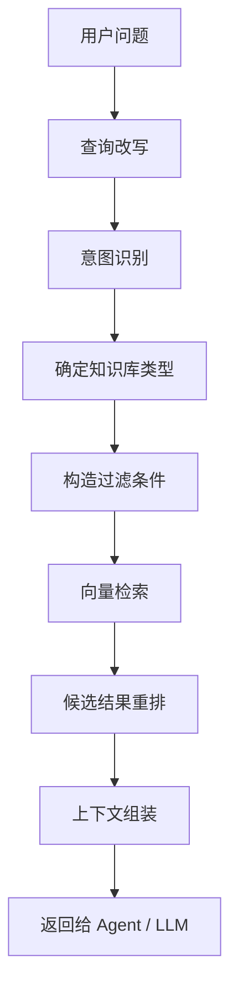

# AI 恋爱智能体 RAG 知识库问答系统设计文档

## 文档信息

| 项目 | 内容 |
| --- | --- |
| 文档名称 | AI 恋爱智能体 RAG 知识库问答系统设计文档 |
| 适用项目 | `AI Love Agent` |
| 文档版本 | `v1.0` |
| 文档目标 | 指导知识库问答、检索增强、记忆检索、混合检索和评估落地 |
| 关联文档 | `PROJECT_PLAN_PYTHON_ENTERPRISE.md`、`AGENTS.md` |

---

## 目录

- [1. 设计目标](#1-设计目标)
- [2. 业务定位](#2-业务定位)
- [3. RAG 总体架构](#3-rag-总体架构)
- [4. 知识库分层设计](#4-知识库分层设计)
- [5. 数据模型与索引规划](#5-数据模型与索引规划)
- [6. 文档接入与清洗流程](#6-文档接入与清洗流程)
- [7. 切分与向量化策略](#7-切分与向量化策略)
- [8. 检索链路设计](#8-检索链路设计)
- [9. 混合检索设计](#9-混合检索设计)
- [10. 问答生成链路设计](#10-问答生成链路设计)
- [11. 与 Agent 的集成方式](#11-与-agent-的集成方式)
- [12. 接口设计建议](#12-接口设计建议)
- [13. 管理后台能力规划](#13-管理后台能力规划)
- [14. 质量评估与监控体系](#14-质量评估与监控体系)
- [15. 安全治理要求](#15-安全治理要求)
- [16. 两期实施规划](#16-两期实施规划)
- [17. 推荐项目结构](#17-推荐项目结构)
- [18. 最终落地建议](#18-最终落地建议)

---

## 1. 设计目标

本设计文档用于为 `AI Love Agent` 项目规划一套完整的 RAG 知识库问答能力，目标如下：

- 为恋爱建议、关系沟通、情绪安抚、安全兜底提供可检索知识支撑。
- 为长期记忆、风格样本和业务知识建立统一的检索框架。
- 支持当前阶段的 `MySQL + PostgreSQL(pgvector)` 向量检索方案。
- 支持二期引入 `Elasticsearch` 实现混合检索。
- 与现有 `FastAPI + LangGraph + LangChain` 架构无缝集成。
- 支持运营后台进行知识导入、审核、发布、回滚和评估。

---

## 2. 业务定位

### 2.1 为什么本项目需要 RAG

AI 恋爱智能体不是一个纯闲聊系统。对于以下场景，仅依赖大模型自身参数知识不够稳定：

- 恋爱建议与沟通策略输出
- 冲突处理和边界感表达
- 用户长期记忆召回
- 风格样本召回与语气复刻
- 安全兜底话术和高风险场景应对

因此需要建设检索增强生成能力，让模型在回答前能够访问“当前项目自己的知识和记忆”。

### 2.2 RAG 在本项目中的职责边界

RAG 负责“找到对回答真正有帮助的上下文”，不负责代替 Agent 决策。

职责如下：

- 检索业务知识
- 检索用户长期记忆
- 检索风格样本
- 检索安全兜底知识
- 返回结构化上下文给 Agent Runtime

不负责的内容：

- 直接决定回答模式
- 决定是否进入安全拦截
- 决定是否进行风格复刻

这些仍由 `LangGraph` 编排层负责。

---

## 3. RAG 总体架构

### 3.1 整体结构图



### 3.2 分层说明

| 层级 | 模块 | 说明 |
| --- | --- | --- |
| 数据接入层 | 文件导入、文本抽取、OCR、结构化解析 | 负责原始资料接入 |
| 索引构建层 | 切分、标签、Embedding、入库 | 负责构建检索基础 |
| 检索服务层 | 向量检索、过滤检索、混合检索、重排 | 负责高质量召回 |
| 编排集成层 | LangGraph / LangChain | 负责决定何时调用检索 |
| 生成与治理层 | LLM、输出审核、安全兜底 | 负责最终回答生成 |
| 运营与评估层 | 后台管理、评估看板、日志监控 | 负责可运营和可优化 |

---

## 4. 知识库分层设计

### 4.1 本项目不应只有一个知识库

建议将 RAG 数据分成以下四类库：

| 知识库类型 | 用途 | 数据来源 |
| --- | --- | --- |
| 恋爱知识库 | 提供沟通建议、约会建议、情绪表达建议 | 运营整理文档、经验库、FAQ |
| 长期记忆库 | 支持“记得你”的连续性回答 | 用户历史事件、偏好、画像摘要 |
| 风格样本库 | 支持按目标对象语气回答 | QQ / 微信聊天记录中筛选出的高质量片段 |
| 安全策略库 | 提供风险场景下的兜底话术和边界表达 | 审核规则、危机干预话术、平台策略 |

### 4.2 推荐分库方式

当前阶段建议逻辑分库，物理上共享 `pgvector` 数据库，但通过 `knowledge_type`、`biz_type`、`tenant_id`、`scene_code` 等元数据分隔。

建议类型值：

- `relationship_knowledge`
- `long_term_memory`
- `style_samples`
- `safety_knowledge`

---

## 5. 数据模型与索引规划

### 5.1 MySQL 侧元数据表建议

#### `kb_document`

用于管理原始知识文档。

| 字段 | 类型 | 说明 |
| --- | --- | --- |
| `id` | bigint | 主键 |
| `document_code` | varchar | 文档编码 |
| `document_name` | varchar | 文档名称 |
| `knowledge_type` | varchar | 知识库类型 |
| `source_type` | varchar | 文件、手工录入、系统生成 |
| `source_uri` | varchar | 原始文件地址 |
| `status` | varchar | 草稿、处理中、已发布、已下线 |
| `version` | int | 文档版本 |
| `tenant_id` | bigint | 租户或用户维度 |
| `created_at` | datetime | 创建时间 |
| `updated_at` | datetime | 更新时间 |

#### `kb_chunk`

用于管理切分后的知识片段元数据。

| 字段 | 类型 | 说明 |
| --- | --- | --- |
| `id` | bigint | 主键 |
| `document_id` | bigint | 所属文档 |
| `chunk_code` | varchar | 分片编码 |
| `knowledge_type` | varchar | 知识库类型 |
| `title` | varchar | 片段标题 |
| `content` | text | 片段内容 |
| `summary` | varchar | 片段摘要 |
| `keywords` | varchar | 关键词 |
| `scene_code` | varchar | 场景标签 |
| `emotion_tag` | varchar | 情绪标签 |
| `relationship_stage` | varchar | 关系阶段标签 |
| `risk_level` | varchar | 风险等级 |
| `source_order` | int | 原文顺序 |
| `status` | varchar | 可用状态 |
| `created_at` | datetime | 创建时间 |

#### `kb_recall_log`

用于记录每次检索召回情况。

| 字段 | 类型 | 说明 |
| --- | --- | --- |
| `id` | bigint | 主键 |
| `request_id` | varchar | 请求 ID |
| `query_text` | text | 用户查询 |
| `knowledge_type` | varchar | 检索知识类型 |
| `retrieval_mode` | varchar | vector、keyword、hybrid |
| `top_k` | int | 召回数量 |
| `recall_result` | json | 召回结果 |
| `created_at` | datetime | 创建时间 |

### 5.2 PostgreSQL pgvector 侧向量表建议

#### `kb_embedding`

| 字段 | 类型 | 说明 |
| --- | --- | --- |
| `id` | bigint | 主键 |
| `chunk_id` | bigint | 关联 MySQL 分片 ID |
| `knowledge_type` | varchar | 知识库类型 |
| `tenant_id` | bigint | 用户或租户维度 |
| `scene_code` | varchar | 场景标签 |
| `embedding` | vector | 向量字段 |
| `content_length` | int | 内容长度 |
| `created_at` | timestamp | 创建时间 |

建议建立以下索引：

- `knowledge_type`
- `tenant_id`
- `scene_code`
- `embedding ivfflat/hnsw` 索引

### 5.3 Elasticsearch 二期索引建议

索引名建议：

- `kb_relationship_v1`
- `kb_style_samples_v1`
- `kb_safety_v1`

ES 主要承担：

- 关键词召回
- 标题检索
- 多字段过滤检索
- BM25 排序
- 与向量检索结果做混合重排

---

## 6. 文档接入与清洗流程

### 6.1 数据来源分类

| 来源 | 处理方式 |
| --- | --- |
| 手工维护知识文档 | 后台导入、结构化清洗 |
| Markdown / Word / PDF | 文本抽取、章节识别、去噪 |
| QQ / 微信聊天记录 | 角色识别、说话人切分、样本打分 |
| 历史会话沉淀 | 自动摘要、标签化、结构化写入 |

### 6.2 清洗步骤


### 6.3 清洗原则

- 去除广告、签名、系统提示、无意义换行。
- 保留章节层级和原始来源信息。
- 聊天记录必须先做角色分离，不能混合双方内容。
- 风格样本必须做质量评分，不是所有消息都适合进入知识库。

---

## 7. 切分与向量化策略

### 7.1 不同数据类型采用不同切分策略

| 数据类型 | 推荐切分方式 |
| --- | --- |
| 恋爱知识文档 | 按标题、段落、场景切分 |
| 长期记忆 | 按事件单元切分 |
| 风格样本 | 按单轮回复或短对话片段切分 |
| 安全策略文档 | 按规则点和场景模板切分 |

### 7.2 切分长度建议

| 场景 | 推荐长度 |
| --- | --- |
| 一般知识文档 | 300 到 800 字 |
| 聊天风格样本 | 20 到 120 字 |
| 记忆事件 | 50 到 200 字 |
| 安全策略片段 | 100 到 300 字 |

### 7.3 Embedding 策略

- 使用中文语义效果稳定的向量模型。
- 文档索引和查询向量模型必须保持一致。
- 对风格样本建议增加标签特征，如：
  - 语气类型
  - 句式类型
  - 情绪倾向
  - 回复主动性

---

## 8. 检索链路设计

### 8.1 标准检索流程



### 8.2 查询改写建议

检索前建议进行轻量查询改写，目的如下：

- 补充隐含主体
- 统一口语表达
- 拆分复杂问题
- 识别关系阶段和情绪维度

例如：

- 原问题：`他突然不回我了怎么办？`
- 改写结果：`暧昧阶段，对方突然不回消息，如何回应和推进关系？`

### 8.3 TopK 建议

| 检索类型 | 初始 TopK |
| --- | --- |
| 恋爱知识库 | 5 到 8 |
| 长期记忆 | 3 到 5 |
| 风格样本 | 4 到 8 |
| 安全策略库 | 2 到 4 |

---

## 9. 混合检索设计

### 9.1 一期方案：纯向量 + 元数据过滤

当前阶段依赖 `PostgreSQL(pgvector)`，推荐策略如下：

- 先通过 `knowledge_type`、`tenant_id`、`scene_code` 做过滤
- 再执行向量检索
- 对结果做简单分数重排

适用场景：

- 恋爱知识召回
- 长期记忆召回
- 风格样本召回

### 9.2 二期方案：向量检索 + ES 关键词检索 + 融合重排

二期引入 `Elasticsearch` 后，推荐混合检索流程：

1. 向量检索召回候选集
2. ES 关键词检索召回候选集
3. 合并去重
4. 使用重排模型或规则重排
5. 返回最终上下文

### 9.3 融合策略建议

| 策略 | 说明 |
| --- | --- |
| 分数加权 | 向量分数 + BM25 分数 |
| Reciprocal Rank Fusion | 不依赖统一分值尺度，适合早期快速落地 |
| 规则优先级 | 风险知识和风格样本可设置更高优先级 |

---

## 10. 问答生成链路设计

### 10.1 知识问答模式

RAG 问答链路建议分为以下步骤：

1. 判断用户是否需要知识增强
2. 选择检索知识库类型
3. 检索并过滤无关结果
4. 组装上下文
5. 生成结构化回答草稿
6. 安全审查后输出

### 10.2 上下文组装原则

- 不要把召回片段原样无脑拼接。
- 只保留与当前问题强相关的内容。
- 不同知识库内容要分块注入。
- 风格样本与知识片段分开注入，避免混淆。

### 10.3 回答模板建议

对于恋爱建议类问答，建议输出结构如下：

- 当前情况理解
- 建议目标
- 建议做法
- 示例回复
- 风险提醒或边界提示

对于安全场景，建议输出结构如下：

- 先共情
- 明确边界
- 提供稳妥建议
- 必要时引导线下支持

---

## 11. 与 Agent 的集成方式

### 11.1 调用原则

RAG 服务不直接暴露给前端，而是由 `LangGraph Agent Runtime` 按需调用。

### 11.2 集成模式

| 模式 | 说明 |
| --- | --- |
| Tool 模式 | 将检索服务封装成 LangChain Tool |
| Node 模式 | 在 LangGraph 中作为固定节点调用 |
| Router 模式 | 根据意图在不同知识库之间路由 |

### 11.3 推荐节点设计

- `decide_retrieval_node`
- `retrieve_relationship_knowledge_node`
- `retrieve_memory_node`
- `retrieve_style_samples_node`
- `retrieve_safety_knowledge_node`
- `rerank_context_node`

---

## 12. 接口设计建议

### 12.1 面向前台问答的接口

#### `POST /api/rag/query`

请求体建议：

```json
{
  "user_id": 1001,
  "session_id": "sess_xxx",
  "query": "他最近总是回得很冷淡，我该怎么聊？",
  "knowledge_types": ["relationship_knowledge", "long_term_memory"],
  "scene_code": "relationship_chat",
  "top_k": 6
}
```

返回体建议：

```json
{
  "request_id": "rag_xxx",
  "rewritten_query": "暧昧阶段，对方回复冷淡时如何继续沟通",
  "contexts": [
    {
      "chunk_id": 123,
      "knowledge_type": "relationship_knowledge",
      "score": 0.92,
      "content": "..."
    }
  ]
}
```

### 12.2 面向后台知识管理的接口

| 接口 | 说明 |
| --- | --- |
| `POST /admin/kb/documents/upload` | 上传知识文档 |
| `POST /admin/kb/documents/publish` | 发布文档 |
| `POST /admin/kb/documents/reindex` | 重新索引 |
| `GET /admin/kb/chunks` | 查看切片结果 |
| `GET /admin/kb/recall-logs` | 查看召回日志 |

---

## 13. 管理后台能力规划

### 13.1 后台模块建议

| 模块 | 功能 |
| --- | --- |
| 文档管理 | 上传、预览、发布、下线、版本控制 |
| 分片管理 | 查看切分结果、修正元数据 |
| 索引管理 | 重建索引、查看向量状态 |
| 检索调试 | 手工输入查询并查看召回结果 |
| 评估中心 | 查看召回命中率、答案效果、失败样本 |

### 13.2 后台必须支持的能力

- 手工修正文档标题和标签
- 预览切片内容
- 触发重新向量化
- 查询召回日志
- 导出评估数据

---

## 14. 质量评估与监控体系

### 14.1 评估维度

| 维度 | 说明 |
| --- | --- |
| Recall@K | 正确知识是否进入候选集 |
| MRR | 正确结果排序是否靠前 |
| Answer Groundedness | 答案是否建立在召回内容上 |
| Context Precision | 召回内容是否相关 |
| Context Recall | 召回内容是否覆盖关键信息 |
| Safety Pass Rate | 安全审核通过率 |

### 14.2 监控指标

- 检索耗时
- 改写耗时
- embedding 耗时
- top_k 命中分布
- 无结果查询比例
- 低质量召回比例

### 14.3 最小评估集建议

建议建立三类评估集：

- 恋爱建议问答集
- 长期记忆问答集
- 风格样本召回集

每类至少准备 50 到 100 条标注样本。

---

## 15. 安全治理要求

### 15.1 知识库内容治理

- 不允许写入违法、暴力、伤害型知识。
- 不允许写入鼓励过度依赖和现实替代的内容。
- 高风险模板必须经过人工审核。

### 15.2 RAG 输出治理

- 召回知识不等于可以直接输出。
- 所有召回内容仍需经过生成与安全审查。
- 风格样本不得覆盖安全边界。

---

## 16. 两期实施规划

### 16.1 一期：可用版 RAG

技术组合：

- `MySQL`
- `PostgreSQL(pgvector)`
- `Redis`
- `MinIO`
- `FastAPI`
- `LangGraph`
- `LangChain`

建设范围：

- 恋爱知识库导入
- 基础向量检索
- 长期记忆检索
- 风格样本检索
- 简单重排
- 召回日志记录

### 16.2 二期：增强版混合检索

新增技术：

- `Elasticsearch`

新增能力：

- 关键词检索
- 混合检索
- 检索调试后台
- 更细粒度标签过滤
- 检索评估看板

---

## 17. 推荐项目结构

```text
app/
  rag/
    ingestion/        # 文档接入、清洗、切分
    embeddings/       # 向量化逻辑
    retrievers/       # 向量检索、ES 检索、混合检索
    rerank/           # 重排逻辑
    services/         # RAG 服务封装
    repositories/     # MySQL / PG / ES 数据访问
    schemas/          # RAG 输入输出模型
    evaluators/       # 评估工具和指标计算
    prompts/          # 查询改写和答案约束 Prompt
```

---

## 18. 最终落地建议

### 18.1 最适合当前项目的方案

当前项目最适合先建设“一套统一 RAG 基础设施 + 四类知识库逻辑分层”的方案，而不是为每个业务场景各写一套独立检索逻辑。

### 18.2 实施优先级

1. 先落地恋爱知识库和长期记忆检索
2. 再落地风格样本检索
3. 再补安全策略库
4. 最后上 Elasticsearch 混合检索

### 18.3 架构建议结论

- RAG 必须与 Agent 编排解耦，但与 Agent Runtime 深度协作。
- 当前阶段优先使用 `PostgreSQL(pgvector)` 统一承载向量检索。
- 二期再引入 `Elasticsearch` 做混合检索增强。
- 检索日志、评估集、后台调试页面应在一期预留，不要后补。
