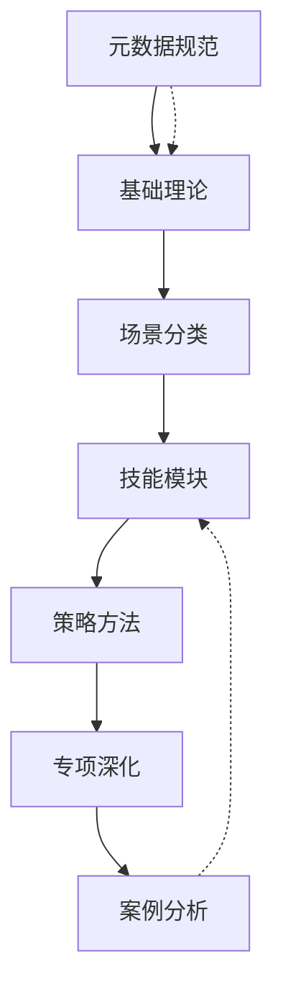

# 知识库概览

> 本文档为企业级 RAG 知识库的总体说明，包含架构设计、目录结构、使用规范和更新记录。

## 一、知识库定位

### 1.1 目标与愿景

本知识库是一个面向 **情感社交 AI Agent** 的企业级知识管理系统，旨在：

| 目标 | 描述 | 衡量指标 |
|------|------|----------|
| 专业性 | 提供心理学、社会学支撑的理论知识 | 100+ 专业概念 |
| 实用性 | 提供可直接应用的话术和策略 | 200+ 话术模板 |
| 覆盖性 | 覆盖情感社交领域的各类场景 | 50+ 典型场景 |
| 可维护性 | 结构化设计便于持续更新 | 模块化架构 |

### 1.2 设计原则

| 原则 | 说明 | 示例 |
|------|------|------|
| 模块化 | 知识高度解耦，可独立使用 | 技能模块可独立引用 |
| 可追溯 | 所有知识都有来源和依据 | 标注学术来源 |
| 实用性 | 理论紧密联系实际 | 每理论配实践指南 |
| 可扩展 | 支持后续持续扩充 | 分类体系预留扩展位 |

## 二、整体架构

### 2.1 六层分类体系

```
┌─────────────────────────────────────────────────────────────┐
│                    案例分析层 (06_case/)                     │
│                    10个典型案例                               │
├─────────────────────────────────────────────────────────────┤
│                    专项深化层 (05_special/)                   │
│                    15个特殊场景处理                           │
├─────────────────────────────────────────────────────────────┤
│                    策略方法层 (04_strategy/)                  │
│                    20个策略方法                               │
├─────────────────────────────────────────────────────────────┤
│                    技能模块层 (03_skill/)                     │
│                    30个核心技能                               │
├─────────────────────────────────────────────────────────────┤
│                    场景分类层 (02_scenario/)                  │
│                    25个场景分类                               │
├─────────────────────────────────────────────────────────────┤
│                    基础理论层 (01_foundation/)                │
│                    15个理论文档                               │
├─────────────────────────────────────────────────────────────┤
│                    元数据与规范 (00_meta/)                    │
│                    4个规范文档                               │
└─────────────────────────────────────────────────────────────┘
```

### 2.2 知识流转关系



## 三、文档统计

### 3.1 文档数量分布

| 层级 | 目录 | 文档数量 | 说明 |
|------|------|----------|------|
| 元数据 | 00_meta | 4 | 规范文档 |
| 基础理论 | 01_foundation | 15 | 理论支撑 |
| 场景分类 | 02_scenario | 25 | 应用场景 |
| 技能模块 | 03_skill | 30 | 核心技能 |
| 策略方法 | 04_strategy | 20 | 方法策略 |
| 专项深化 | 05_special | 15 | 特殊情况 |
| 案例分析 | 06_case | 10 | 案例参考 |
| **合计** | - | **119** | - |

### 3.2 文档类型分布

| 类型 | 数量 | 说明 |
|------|------|------|
| 概念定义 (concept) | 15 | 理论概念 |
| 指南规范 (guideline) | 70 | 操作指南 |
| Q&A 问答 (qa) | 24 | 问题解答 |
| 场景案例 (scenario) | 10 | 案例分析 |

## 四、使用指南

### 4.1 Agent 检索流程

```
用户输入 → 意图识别 → 标签匹配 → 分类定位 → 文档检索 → 知识组装 → 响应生成
```

### 4.2 文档引用规范

**绝对引用**（推荐）：
```markdown
请参考 [[03_skill/沟通技巧/01_开场白设计艺术]]
```

**相对引用**：
```markdown
请参考 [[01_开场白设计艺术]]
```

### 4.3 标签使用规范

每个文档必须包含以下标签：
- **主分类标签**：如 `沟通技巧`、`情绪管理`
- **关系阶段标签**：如 `陌生期`、`暧昧期`
- **问题类型标签**：如 `破冰困难`、`冲突处理`

示例：
```yaml
tags:
  - 沟通技巧        # 主分类
  - 陌生期          # 关系阶段
  - 破冰困难        # 问题类型
```

## 五、更新规范

### 5.1 版本号规则

采用语义化版本号：`主版本.次版本.修订号`

| 版本类型 | 更新内容 | 示例 |
|----------|----------|------|
| 主版本 | 架构调整、分类变更 | 1.0.0 → 2.0.0 |
| 次版本 | 新增文档、功能扩展 | 1.0.0 → 1.1.0 |
| 修订版 | 内容修正、细节优化 | 1.0.0 → 1.0.1 |

### 5.2 更新日志

| 日期 | 版本 | 更新内容 | 更新人 |
|------|------|----------|--------|
| 2026-04-19 | 1.0.0 | 初始版本创建 | 知识库团队 |

### 5.3 文档状态

| 状态 | 说明 | 标记方式 |
|------|------|----------|
| draft | 草稿 | 未发布 |
| active | 活跃 | 当前使用 |
| deprecated | 已废弃 | 保留但不推荐 |
| archived | 已归档 | 历史版本 |

## 六、质量标准

### 6.1 文档质量检查清单

- [ ] 包含完整的 Frontmatter 元数据
- [ ] 使用标准标签体系
- [ ] 放置在正确分类目录
- [ ] 包含交叉引用链接
- [ ] 结构符合对应模板
- [ ] 话术示例自然得体
- [ ] 案例分析深入透彻

### 6.2 内容准确性标准

| 标准 | 要求 |
|------|------|
| 理论准确性 | 引用权威学术来源 |
| 话术实用性 | 经过模拟验证 |
| 案例代表性 | 反映典型情境 |
| 知识时效性 | 定期更新维护 |

## 七、贡献指南

### 7.1 新文档创建流程

1. 确定文档分类和位置
2. 选择对应模板
3. 填写完整元数据
4. 按模板结构编写内容
5. 通过质量检查
6. 添加到知识库索引

### 7.2 文档审核标准

| 审核项 | 标准 |
|--------|------|
| 格式规范 | 符合模板要求 |
| 内容完整 | 无缺失模块 |
| 知识准确 | 无错误信息 |
| 引用正确 | 链接有效 |
| 语言规范 | 表述清晰准确 |

## 八、相关文档

| 文档 | 说明 |
|------|------|
| [[01_标签体系]] | 完整标签定义与使用规范 |
| [[02_分类体系]] | 四层分类详细说明 |
| [[03_实体关系定义]] | 知识图谱实体关系图 |

## 九、联系方式

| 角色 | 职责 | 备注 |
|------|------|------|
| 知识库管理员 | 整体维护 | - |
| 内容审核 | 质量把控 | - |
| 领域专家 | 专业指导 | 心理学/社会学 |

---

**最后更新**：2026-04-19
**版本**：1.0.0
**维护团队**：知识库团队

---

<!-- 知识库骨架补齐 -->

## 索引表

| 字段 | 含义 | 示例 |
|------|------|------|
| title | 文档标题 | 异地关系 |
| category | 所属分类 | 05_special |
| tags | 标签数组 | [异地恋, 信任] |
| difficulty | 难度等级 | beginner/intermediate/advanced |

## 字段定义

- `title`：文档主标题，唯一，不含路径。
- `description`：一句话摘要，≤100字。
- `tags`：用于检索与过滤的标签数组，遵循 `01_标签体系.md`。
- `related_docs`：显式声明的强关联文档路径。
- `confidence_level`：high/medium/low，标记内容的可信度。

## 使用示例

```yaml
---
title: 异地关系
category: 05_special
tags: [异地恋, 信任建立]
difficulty: advanced
confidence_level: high
---
```

- 新增文档：复制 `_templates/` 下对应模板。
- 修订文档：保留原 frontmatter，按本规范补齐缺失字段。
