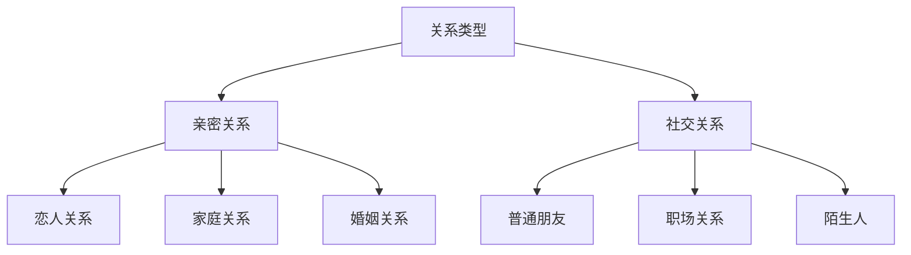

# 标签体系

> 本文档定义了企业级 RAG 知识库的完整标签体系，包括标签分类、层级结构、定义说明和使用规范。

## 一、标签设计原则

| 原则 | 说明 | 示例 |
|------|------|------|
| 互斥性 | 同级标签不重叠 | "愤怒"和"悲伤"不共存 |
| 完备性 | 覆盖所有知识领域 | 所有文档都有标签 |
| 可扩展 | 支持新增标签 | 预留扩展空间 |
| 可量化 | 便于统计检索 | 明确计数维度 |

## 二、标签分类体系

### 2.1 关系类型标签（主标签）

#### 亲密关系类

| 标签 | 定义 | 适用文档 |
|------|------|----------|
| `亲密关系/恋人关系` | 恋爱关系相关的知识和场景 | 约会、表白、分手 |
| `亲密关系/家庭关系` | 家庭成员间的关系 | 父母、兄弟姐妹 |
| `亲密关系/婚姻关系` | 婚姻相关的知识和场景 | 结婚、婚后生活 |

#### 社交关系类

| 标签 | 定义 | 适用文档 |
|------|------|----------|
| `社交关系/普通朋友` | 朋友关系相关 | 交友、维护友谊 |
| `社交关系/职场关系` | 职场中的人际关系 | 同事、上司、客户 |
| `社交关系/陌生人` | 与陌生人交往 | 破冰、社交活动 |

### 2.2 关系阶段标签

| 标签 | 定义 | 核心特征 | 关键任务 |
|------|------|----------|----------|
| `阶段/陌生期` | 尚未认识的阶段 | 无交集、无了解 | 建立联系 |
| `阶段/认识期` | 初识阶段 | 初步接触、礼貌交往 | 留下好印象 |
| `阶段/熟悉期` | 了解加深阶段 | 相互了解、有话题 | 深化了解 |
| `阶段/暧昧期` | 关系模糊阶段 | 情感萌动、试探阶段 | 明确关系 |
| `阶段/亲密期` | 确立关系阶段 | 正式确认、相互承诺 | 稳定关系 |
| `阶段/稳定期` | 长期发展阶段 | 稳定经营、共同成长 | 维护发展 |
| `阶段/冷淡期` | 关系降温阶段 | 联系减少、热情消退 | 修复升温 |
| `阶段/分离期` | 关系结束阶段 | 分手、断开联系 | 妥善处理 |

### 2.3 技能类型标签

#### 沟通技能

| 标签 | 定义 | 包含内容 |
|------|------|----------|
| `技能/沟通` | 表达能力相关 | 表达自己、传递信息 |
| `技能/倾听` | 理解他人能力 | 理解需求、感受 |
| `技能/提问` | 提问技巧 | 开放式/封闭式提问 |
| `技能/反馈` | 回应他人 | 认同、共情、建议 |

#### 情绪技能

| 标签 | 定义 | 包含内容 |
|------|------|----------|
| `技能/情绪识别` | 识别情绪 | 察言观色、情绪判断 |
| `技能/情绪调节` | 管理情绪 | 控制冲动、保持冷静 |
| `技能/共情` | 理解感受 | 换位思考、感同身受 |
| `技能/情绪表达` | 表达感受 | 合理表达、适度倾诉 |

#### 关系技能

| 标签 | 定义 | 包含内容 |
|------|------|----------|
| `技能/边界表达` | 设定界限 | 拒绝、说不 |
| `技能/信任建立` | 建立信任 | 言行一致、兑现承诺 |
| `技能/冲突处理` | 化解矛盾 | 沟通协商、妥协共赢 |
| `技能/关系维护` | 持续经营 | 日常联系、仪式感 |

### 2.4 问题类型标签

#### 沟通问题

| 标签 | 定义 | 典型场景 |
|------|------|----------|
| `问题/破冰困难` | 不知道怎么开始 | 初次见面、搭讪 |
| `问题/话题枯竭` | 不知道说什么 | 聊天冷场 |
| `问题/表达不清` | 说不清楚想法 | 表白被误解 |
| `问题/沟通障碍` | 沟通不顺畅 | 吵架、冷战 |

#### 关系问题

| 标签 | 定义 | 典型场景 |
|------|------|----------|
| `问题/关系升温` | 想推进关系 | 不知道怎么升级 |
| `问题/关系降温` | 关系变淡 | 联系减少 |
| `问题/关系确认` | 是否表白 | 确认关系的时机 |
| `问题/分手挽回` | 想要复合 | 分手后处理 |

#### 情绪问题

| 标签 | 定义 | 典型场景 |
|------|------|----------|
| `问题/情绪失控` | 控制不住情绪 | 冲动言行 |
| `问题/情绪低落` | 心情不好 | 需要安慰 |
| `问题/情绪传递` | 负面情绪影响 | 迁怒他人 |

### 2.5 情绪类型标签

| 标签 | 定义 | 表达特征 |
|------|------|----------|
| `情绪/喜悦` | 正面积极情绪 | 开心、兴奋、满足 |
| `情绪/悲伤` | 负面情绪 | 难过、失落、沮丧 |
| `情绪/愤怒` | 强烈负面情绪 | 生气、恼怒、暴躁 |
| `情绪/恐惧` | 担忧害怕情绪 | 焦虑、不安、紧张 |
| `情绪/惊讶` | 意外情绪 | 惊讶、震惊 |
| `情绪/厌恶` | 排斥情绪 | 讨厌、反感 |
| `情绪/焦虑` | 担忧不安情绪 | 着急、牵挂、顾虑 |
| `情绪/回避` | 逃避心态 | 不想面对、想躲 |

### 2.6 对象标签

#### 按性别划分

| 标签 | 定义 |
|------|------|
| `对象/男性` | 男性相关 |
| `对象/女性` | 女性相关 |

#### 按角色划分

| 标签 | 定义 |
|------|------|
| `对象/追求者` | 主动追求的一方 |
| `对象/被追求者` | 被追求的一方 |
| `对象/第三方` | 涉及第三方 |

### 2.7 方式标签

| 标签 | 定义 | 使用场景 |
|------|------|----------|
| `方式/线上` | 网络交流 | 微信、社交媒体 |
| `方式/线下` | 面对面交流 | 约会、活动 |
| `方式/电话` | 语音交流 | 通话、视频 |
| `方式/文字` | 书面交流 | 短信、邮件 |

### 2.8 难度标签

| 标签 | 定义 | 说明 |
|------|------|------|
| `难度/初级` | 基础问题 | 新手可处理 |
| `难度/中级` | 需要技巧 | 需要学习 |
| `难度/高级` | 复杂问题 | 需要专业指导 |

## 三、标签使用规范

### 3.1 必选标签

每个文档必须包含以下必选标签：

| 标签类型 | 数量要求 | 示例 |
|----------|----------|------|
| 主分类标签 | 1个 | `沟通技巧` |
| 关系阶段标签 | 至少1个 | `陌生期` |
| 问题类型标签 | 至少1个 | `破冰困难` |

### 3.2 可选标签

| 标签类型 | 数量建议 | 示例 |
|----------|----------|------|
| 情绪类型标签 | 0-2个 | `焦虑`、`回避` |
| 方式标签 | 0-1个 | `线上`、`线下` |
| 难度标签 | 0-1个 | `初级` |

### 3.3 标签组合示例

```yaml
# 场景：如何在线上搭讪陌生人
tags:
  - 社交关系/陌生人      # 主分类
  - 阶段/陌生期          # 关系阶段
  - 问题/破冰困难        # 问题类型
  - 方式/线上            # 方式
  - 难度/初级            # 难度

# 场景：如何安慰失恋的朋友
tags:
  - 技能/共情            # 主分类
  - 情绪/悲伤            # 情绪类型
  - 问题/情绪低落        # 问题类型
  - 难度/初级            # 难度
```

## 四、标签层级结构

### 4.1 层级关系图



### 4.2 标签继承关系

- `技能/沟通` 属于 `技能` 大类
- `问题/破冰困难` 属于 `问题` 大类
- 检索时支持模糊匹配：`沟通` 可匹配到 `技能/沟通`

## 五、标签检索优化

### 5.1 检索策略

| 检索方式 | 说明 | 示例 |
|----------|------|------|
| 精确匹配 | 完整标签 | `技能/沟通` |
| 前缀匹配 | 大类匹配 | `技能/*` |
| 模糊匹配 | 关键词匹配 | `沟通` |

### 5.2 标签权重

| 标签位置 | 权重 | 说明 |
|----------|------|------|
| 主分类标签 | 高 | 核心分类 |
| 阶段标签 | 中 | 上下文 |
| 问题标签 | 中 | 应用场景 |
| 其他标签 | 低 | 辅助信息 |

## 六、标签维护

### 6.1 新增标签流程

1. 提出申请（说明标签定义和使用场景）
2. 审核评估（是否符合设计原则）
3. 分类归属（确定标签位置）
4. 文档更新（更新相关文档）
5. 文档更新（更新本标签体系文档）

### 6.2 标签废弃流程

1. 标记废弃（设置状态为 deprecated）
2. 文档迁移（将文档迁移到其他标签）
3. 文档更新（更新本标签体系文档）
4. 完全移除（确认无引用后移除）

## 七、相关文档

| 文档 | 说明 |
|------|------|
| [[00_知识库概览]] | 知识库整体架构 |
| [[02_分类体系]] | 文档分类体系 |
| [[03_实体关系定义]] | 实体关系定义 |

---

**最后更新**：2026-04-19
**版本**：1.0.0

---

<!-- 知识库骨架补齐 -->

## 索引表

| 字段 | 含义 | 示例 |
|------|------|------|
| title | 文档标题 | 异地关系 |
| category | 所属分类 | 05_special |
| tags | 标签数组 | [异地恋, 信任] |
| difficulty | 难度等级 | beginner/intermediate/advanced |

## 字段定义

- `title`：文档主标题，唯一，不含路径。
- `description`：一句话摘要，≤100字。
- `tags`：用于检索与过滤的标签数组，遵循 `01_标签体系.md`。
- `related_docs`：显式声明的强关联文档路径。
- `confidence_level`：high/medium/low，标记内容的可信度。

## 使用示例

```yaml
---
title: 异地关系
category: 05_special
tags: [异地恋, 信任建立]
difficulty: advanced
confidence_level: high
---
```

- 新增文档：复制 `_templates/` 下对应模板。
- 修订文档：保留原 frontmatter，按本规范补齐缺失字段。
