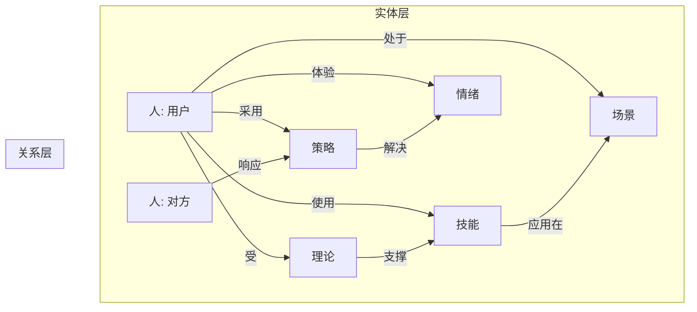
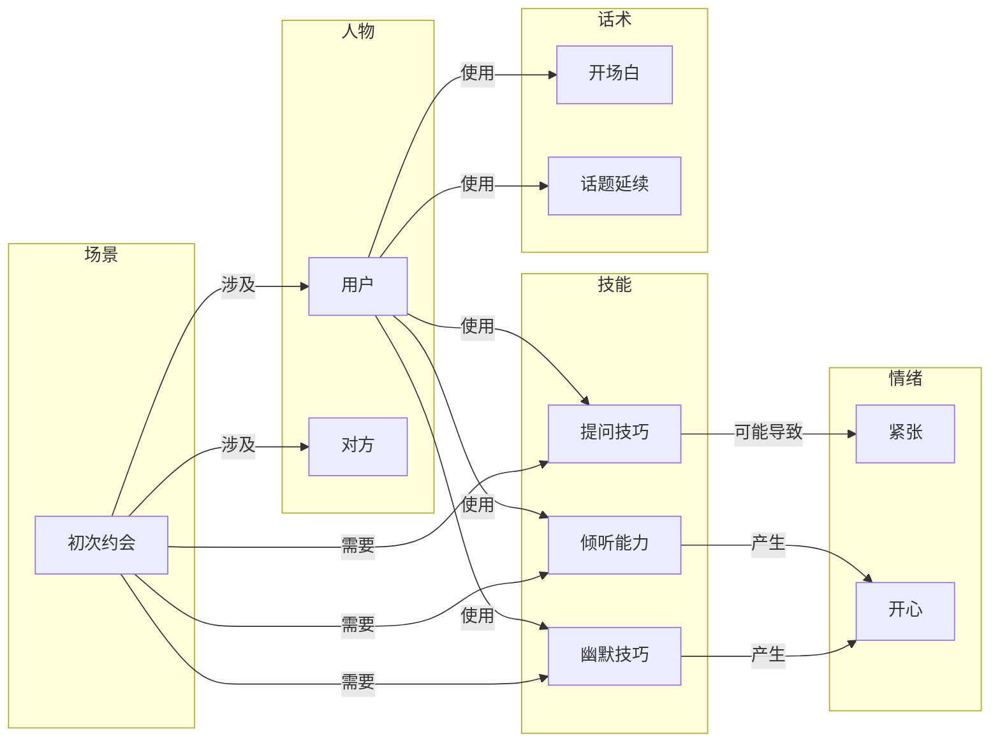
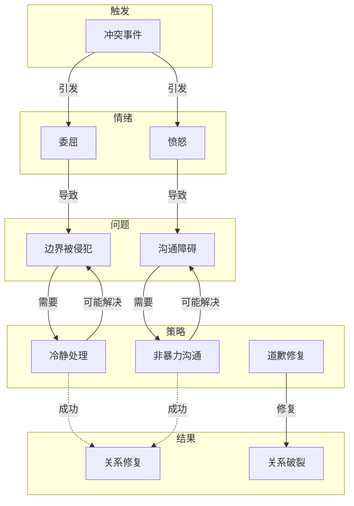

# 实体关系定义

> 本文档定义了企业级 RAG 知识库的知识图谱结构，包括实体类型、关系类型、属性定义和推理规则。

## 一、知识图谱概述

### 1.1 设计目的

知识图谱为 Agent 提供：
- **语义关联**：理解概念间的深层关系
- **多跳推理**：支持跨文档知识推理
- **上下文增强**：提供相关背景知识
- **智能检索**：基于关系的精准检索

### 1.2 架构图



## 二、核心实体类型

### 2.1 实体类型总览

| 实体类型 | 说明 | 示例 | 数量 |
|----------|------|------|------|
| Person | 人物 | 用户、对方、第三方 | 2 |
| Relationship | 关系 | 恋人、朋友、同事 | 8 |
| Skill | 技能 | 沟通、共情、倾听 | 15 |
| Scenario | 场景 | 约会、相亲、职场 | 25 |
| Theory | 理论 | 依恋理论、社会交换 | 15 |
| Strategy | 策略 | 破冰、推进、修复 | 20 |
| Emotion | 情绪 | 喜悦、悲伤、愤怒 | 8 |
| Behavior | 行为 | 搭讪、表白、道歉 | 12 |
| Phrase | 话术 | 开场白、赞美、拒绝 | 30+ |

### 2.2 人物实体 (Person)

```yaml
Person:
  - 用户 (user): 使用 Agent 的一方
  - 对方 (target): 交互对象
  - 第三方 (third_party): 涉及的其他人物
```

**属性定义**：
| 属性 | 类型 | 说明 |
|------|------|------|
| name | string | 名称（脱敏） |
| gender | enum | 男性/女性/未知 |
| age_range | string | 年龄段 |
| personality | list | 人格特征 |
| attachment_style | enum | 依恋类型 |
| communication_style | enum | 沟通风格 |

### 2.3 关系实体 (Relationship)

```yaml
Relationship:
  - 恋人关系 (romantic): 恋爱中的关系
  - 暧昧关系 (ambiguous): 尚未明确的关系
  - 朋友关系 (friend): 普通朋友关系
  - 职场关系 (workplace): 工作中的关系
  - 家庭关系 (family): 家庭成员关系
  - 陌生人关系 (stranger): 尚未认识
  - 追求关系 (pursuing): 一方追求另一方
  - 前任关系 (ex): 分手后的关系
```

**关系阶段**：
```yaml
RelationshipStage:
  - 陌生期: 尚未认识
  - 认识期: 初识阶段
  - 熟悉期: 相互了解
  - 暧昧期: 情感萌动
  - 亲密期: 确立关系
  - 稳定期: 长期发展
  - 冷淡期: 关系降温
  - 分离期: 关系结束
```

### 2.4 技能实体 (Skill)

```yaml
Skill:
  沟通类:
    - 表达能力: 清晰表达自己的想法
    - 倾听能力: 理解对方的表达
    - 提问技巧: 通过提问获取信息
    - 反馈技巧: 给对方回应

  情绪类:
    - 情绪识别: 察觉他人情绪
    - 情绪调节: 管理自己的情绪
    - 共情能力: 理解他人感受
    - 情绪表达: 合理表达情绪

  关系类:
    - 边界设定: 表达和维护界限
    - 信任建立: 建立互信关系
    - 冲突处理: 化解矛盾
    - 关系维护: 持续经营关系
```

### 2.5 场景实体 (Scenario)

```yaml
Scenario:
  亲密关系场景:
    - 初次搭讪: 认识陌生人
    - 相亲场景: 相亲约会
    - 初次约会: 第一次正式约会
    - 告白场景: 表白时刻
    - 挽回场景: 分手后挽回

  社交场景:
    - 职场社交: 工作场合
    - 社交活动: 聚会、沙龙
    - 线上社交: 社交媒体
    - 家庭聚会: 家人相处

  问题场景:
    - 冷场场景: 不知道说什么
    - 冲突场景: 发生争吵
    - 冷战场景: 对方不理
    - 分手场景: 关系结束
```

### 2.6 理论实体 (Theory)

```yaml
Theory:
  心理学理论:
    - 依恋理论: 成人依恋类型
    - 认知偏差: 判断误区
    - 情绪调节: 情绪管理机制
    - 自我披露: 亲密感建立

  社会学原理:
    - 社会交换: 成本收益分析
    - 社交网络: 关系网络
    - 角色理论: 社会角色
    - 群体规范: 群体影响

  传播学理论:
    - 沟通媒介: 传播渠道
    - 非语言沟通: 肢体语言
    - 积极倾听: 倾听技巧
    - 反馈机制: 信息确认
```

### 2.7 策略实体 (Strategy)

```yaml
Strategy:
  破冰策略:
    - 话题切入: 选择合适话题
    - 共同点发现: 找到共同兴趣
    - 幽默开场: 用幽默破冰
    - 价值展示: 展现自身价值

  信任策略:
    - 一致性展示: 言行一致
    - 脆弱性展示: 适度展示弱点
    - 承诺兑现: 说到做到
    - 信任修复: 修复破裂的信任

  推进策略:
    - 试探信号: 识别对方信号
    - 渐进推进: 逐步升级
    - 节奏把控: 把握时机
    - 推进被拒: 被拒后的处理

  修复策略:
    - 冷战打破: 如何破冰
    - 道歉策略: 有效道歉
    - 原谅和解: 重建关系
    - 边界重建: 重新设定边界
```

### 2.8 情绪实体 (Emotion)

```yaml
Emotion:
  正面情绪:
    - 喜悦: 开心、快乐、满足
    - 兴奋: 激动、期待
    - 温暖: 被关心、被爱
    - 自豪: 被认可、被欣赏

  负面情绪:
    - 悲伤: 难过、失落
    - 愤怒: 生气、不满
    - 恐惧: 害怕、担心
    - 焦虑: 不安、紧张
    - 失望: 期望落空
    - 委屈: 被误解、被冤枉

  中性情绪:
    - 平静: 平和、淡定
    - 困惑: 不理解、迷茫
```

## 三、关系类型定义

### 3.1 关系类型总览

| 关系类型 | 说明 | 反向关系 | 示例 |
|----------|------|----------|------|
| has_skill | 拥有技能 | - | 用户 has_skill 表达能力 |
| uses_skill | 使用技能 | - | 约会 uses_skill 沟通能力 |
| applies_to | 适用于 | - | 策略 applies_to 场景 |
| based_on | 基于理论 | - | 策略 based_on 理论 |
| causes | 导致 | caused_by | 行为 causes 情绪 |
| resolves | 解决 | resolved_by | 策略 resolves 问题 |
| part_of | 属于 | contains | 场景 part_of 分类 |
| related_to | 相关 | related_to | 概念 related_to 概念 |
| opposes | 对立 | opposes | 行为 opposes 行为 |
| requires | 需要 | - | 策略 requires 技能 |

### 3.2 关系详细定义

#### 使用关系 (uses / used_by)

```
用户 --使用--> 技能
技能 --被用于--> 场景
```

**示例**：
- 用户 使用 倾听能力 → 用于 相亲场景
- 用户 使用 幽默技巧 → 用于 破冰场景

#### 依赖关系 (depends_on)

```
策略 --依赖--> 理论
技能 --依赖--> 理论
```

**示例**：
- 非暴力沟通 依赖 沟通理论
- 信任建立策略 依赖 社会交换理论

#### 因果关系 (causes / caused_by)

```
行为 --导致--> 情绪
行为 --导致--> 关系变化
```

**示例**：
- 过度追问 导致 对方焦虑
- 及时回应 导致 信任增加

#### 解决关系 (resolves / resolved_by)

```
策略 --解决--> 问题
话术 --解决--> 沟通障碍
```

**示例**：
- 道歉策略 解决 关系破裂
- 开场白话术 解决 破冰困难

#### 对立关系 (opposes)

```
行为 --对立--> 行为
情绪 --对立--> 情绪
```

**示例**：
- 控制 互斥 放任
- 坦诚 互斥 隐瞒

## 四、属性定义

### 4.1 核心属性

| 属性 | 适用实体 | 类型 | 说明 |
|------|----------|------|------|
| name | 全部 | string | 名称 |
| description | 全部 | string | 描述 |
| category | 全部 | string | 所属分类 |
| tags | 全部 | list | 标签列表 |
| importance | 策略/技能 | enum | 重要程度 |
| difficulty | 技能/场景 | enum | 难度等级 |
| effectiveness | 策略/话术 | enum | 有效程度 |

### 4.2 实体特定属性

```yaml
# 技能属性
Skill:
  level_required: enum[基础/进阶/高级]
  time_to_master: string
  related_skills: list[Skill]

# 场景属性
Scenario:
  stage: enum[关系阶段]
  participants: list[Person]
  frequency: enum[常见/偶尔/罕见]
  emotional_intensity: enum[高/中/低]

# 策略属性
Strategy:
  success_rate: float
  risk_level: enum[高/中/低]
  time_needed: string
  prerequisites: list[Skill]

# 话术属性
Phrase:
  tone: enum[正式/半正式/轻松]
  length: enum[短/中/长]
  applicable_gender: enum[男/女/通用]
  context: list[Scenario]
```

## 五、推理规则

### 5.1 技能推导规则

```
IF 用户 处于 场景A
AND 场景A 需要 技能B
AND 用户 不具备 技能B
THEN 推荐学习 技能B
```

### 5.2 问题解决规则

```
IF 用户 遇到 问题X
AND 问题X 属于 类型Y
AND 类型Y 的 解决方案 是 策略Z
AND 策略Z 需要 技能C
AND 用户 具备 技能C
THEN 推荐 策略Z
```

### 5.3 风险预警规则

```
IF 行为A 导致 情绪B
AND 情绪B 是 负面情绪
AND 负面情绪 导致 关系降温
THEN 行为A 是 风险行为
```

### 5.4 场景适配规则

```
IF 场景 是 职场社交
THEN 策略 应该 正式/专业
AND 话术 应该 礼貌/得体

IF 场景 是 亲密关系
THEN 策略 应该 真诚/自然
AND 话术 应该 温暖/关心
```

## 六、图谱示例

### 6.1 场景：初次约会



### 6.2 场景：冲突处理



## 七、查询示例

### 7.1 场景：如何追女生

```
查询：
用户想要追求女性，
需要什么技能？使用什么策略？
容易遇到什么问题？

结果：
技能：
  - 表达能力
  - 共情能力
  - 情绪识别

策略：
  - 破冰策略
  - 信任建立策略
  - 关系推进策略

问题：
  - 破冰困难
  - 不知道如何推进
  - 关系降温
```

### 7.2 场景：挽回前任

```
查询：
用户想要挽回前任，
应该怎么做？

结果：
前提：
  - 分析分手原因
  - 判断关系状态
  - 评估挽回可能性

策略：
  - 冷静期策略
  - 二次吸引策略
  - 信任修复策略

话术：
  - 道歉话术
  - 联系话术
  - 复合表白话术
```

## 八、相关文档

| 文档 | 说明 |
|------|------|
| [[00_知识库概览]] | 知识库整体架构 |
| [[01_标签体系]] | 标签体系定义 |
| [[02_分类体系]] | 分类体系定义 |

---

**最后更新**：2026-04-19
**版本**：1.0.0

---

<!-- 知识库骨架补齐 -->

## 索引表

| 字段 | 含义 | 示例 |
|------|------|------|
| title | 文档标题 | 异地关系 |
| category | 所属分类 | 05_special |
| tags | 标签数组 | [异地恋, 信任] |
| difficulty | 难度等级 | beginner/intermediate/advanced |

## 字段定义

- `title`：文档主标题，唯一，不含路径。
- `description`：一句话摘要，≤100字。
- `tags`：用于检索与过滤的标签数组，遵循 `01_标签体系.md`。
- `related_docs`：显式声明的强关联文档路径。
- `confidence_level`：high/medium/low，标记内容的可信度。

## 使用示例

```yaml
---
title: 异地关系
category: 05_special
tags: [异地恋, 信任建立]
difficulty: advanced
confidence_level: high
---
```

- 新增文档：复制 `_templates/` 下对应模板。
- 修订文档：保留原 frontmatter，按本规范补齐缺失字段。
